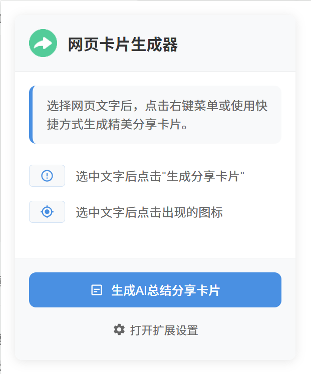

# WebCard-AI 网页卡片生成器

一款强大的 Chrome 浏览器扩展，可以将网页内容转换为精美的分享卡片。支持一键复制、自定义样式、多种主题等功能。

## ✨ 功能特性

### 1. 智能选择与快速生成
- 🔍 选中文本后自动显示浮动按钮
- 🖱️ 支持右键菜单快速生成
- ⚡ 一键复制卡片到剪贴板

### 2. 精美卡片设计
- 🎨 多种主题风格（简约、复古、现代）
- 🌈 自定义背景颜色和渐变
- 📷 支持自定义背景图片
- 🔤 丰富的字体选项

### 3. 智能信息提取
- 🔗 自动获取网站图标（支持高清图标）
- 📱 自动生成页面二维码（支持多个二维码服务）
- 📅 智能时间戳格式化

### 4. 高级功能
- 💾 支持多种导出格式（PNG、JPG、WEBP、PDF）
- 🎯 高质量图片生成
- 🔒 隐私保护，所有数据本地处理
- 🤖 支持 AI 智能总结网页内容
- 🎨 多种精美卡片模板
- 🔧 灵活的自定义设置
- 📱 响应式设计,适配多种设备

## 🚀 安装方法

### 开发者安装
1. 下载或克隆本仓库
2. 打开 Chrome 浏览器，进入扩展程序页面（chrome://extensions/）
3. 开启"开发者模式"
4. 点击"加载已解压的扩展程序"
5. 选择项目文件夹

## 📖 使用说明

### 基本使用
1. 在网页中选择要分享的文本
2. 点击出现的浮动按钮，或使用右键菜单
3. 卡片将自动生成并复制到剪贴板

### 自定义设置
1. 点击扩展图标，打开设置面板
2. 选择喜欢的主题风格
3. 调整字体、颜色等选项
4. 设置导出格式和质量

## 注意事项

- 需要自行申请 AI 服务的 API Key
- 建议使用代理服务以提高连接稳定性
- 导出大尺寸图片时可能需要较长处理时间
- 部分网站可能限制内容提取

## 🛠️ 技术栈

- Chrome Extension API (Manifest V3)
- JavaScript ES6+
- HTML5 & CSS3
- html2canvas
- Google Charts API (二维码生成)

## 📝 更新日志

### v1.0.1 (2025-02)
- ✨ 基础卡片生成功能
- 🎨 三种主题风格
- 📋 一键复制到剪贴板

## 🤝 贡献指南

欢迎提交 Issue 和 Pull Request！

1. Fork 本仓库
2. 创建特性分支：`git checkout -b feature/AmazingFeature`
3. 提交改动：`git commit -m 'Add some AmazingFeature'`
4. 推送分支：`git push origin feature/AmazingFeature`
5. 提交 Pull Request

## 📄 开源协议

本项目基于 MIT 协议开源，详见 [LICENSE](LICENSE) 文件。

## 作者

- GitHub: [@USERNAME](https://github.com/USERNAME)

## Star History

## 🙏 致谢

- [html2canvas](https://html2canvas.hertzen.com/)
- [Google Charts API](https://developers.google.com/chart)
- [QR Server API](https://goqr.me/api/)